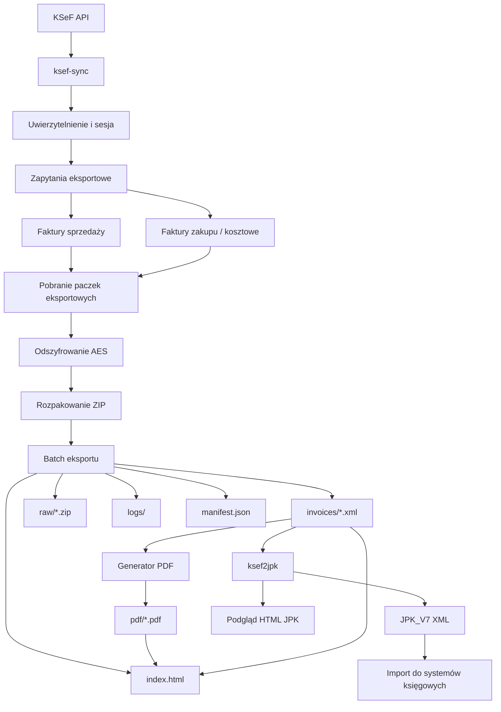

# ksef-sync
`ksef-sync` to narzędzie w Pythonie do lokalnej synchronizacji faktur z KSeF, obsługi batchy XML, generowania podglądów PDF oraz przygotowania danych do dalszego przetwarzania, w szczególności pod kątem JPK_V7.

> Lokalny pipeline ETL dla KSeF
> KSeF → XML → PDF → HTML → JPK_V7

Projekt wspiera proces:

```text
KSeF API → eksport faktur → paczki ZIP → XML → PDF → manifest → indeks HTML → dane do JPK_V7
```

## Status projektu

Projekt rozwijany aktywnie.


## Wymagania

- Python 3.13 +
- Node.js 20+
- PowerShell 7+ (Windows recommended)
- dostęp do środowiska KSeF

## Pipeline

```
KSeF API → batch XML → PDF → manifest → JPK
```


## Funkcje

* przyrostowa synchronizacja faktur sprzedaży i zakupu z KSeF API
* obsługa uwierzytelnienia i sesji KSeF
* pobieranie, odszyfrowywanie i rozpakowywanie paczek KSeF
* przetwarzanie batchy XML faktur
* generowanie podglądu faktur PDF
* budowanie indeksu HTML dla batchy faktur
* eksport danych do struktur JPK_V7
* generowanie manifestów batchy i metadanych eksportu
* obsługa logów, retry oraz walidacji pobranych danych
* automatyczne testy, linting i kontrola jakości kodu


## Diagram działania



## Instalacja

### Klonowanie repozytorium
```bash
git clone https://github.com/dpolz/ksef-sync.git
cd ksef-sync
```
## Środowisko Python

Utworzenie i aktywacja virtual environment:
```bash
python -m venv venv
.\venv\Scripts\Activate.ps1
```
Aktualizacja pip i instalacja zależności:

```bash
python -m pip install --upgrade pip
pip install -r requirements.txt
```

Instalacja narzędzi developerskich:

```bash
pip install -e ".[dev]"
```
### Generator PDF KSeF (Node.js)

Instalacja zależności Node.js:

```bash
cd pdf_generator
npm install
npm run build
```

## Konfiguracja

Utwórz plik `.env` na podstawie `.env.example`.

Przykład:
```
KSEF_ENV=demo
KSEF_NIP=0000000000
KSEF_TOKEN=your-token
```
### Konfiguracja `.env`

| Zmienna | Opis |
|---|---|
| `KSEF_ENV` | środowisko (`demo` / `prod`) |
| `KSEF_NIP` | NIP podatnika |
| `KSEF_TOKEN` | token autoryzacyjny |

```markdown
## Bezpieczeństwo

Projekt nie przechowuje danych w chmurze. Całość przetwarzania odbywa się lokalnie.

Dane autoryzacyjne KSeF powinny być przechowywane wyłącznie
w lokalnym pliku `.env`, który nie jest commitowany do repozytorium.

Pliki `.env`, batch exportów, logi oraz wygenerowane dane
są domyślnie wykluczone przez `.gitignore`.
```

## Uruchomienie

### Synchronizacja przyrostowa (domyślnie)

```bash
python main.py
```

Domyślnie projekt pobiera faktury z ostatnich 7 dni
i zapisuje stan synchronizacji w `data/state.json`.

### Synchronizacja pełna dla wybranego okresu

```bash
python main.py --mode full-sync --year 2026 --month 5
```

### Bezpośrednie uruchomienie modułu

```bash
python -m ksef.sync_ksef_incremental
```

## Przykładowe uruchomienie

```bash
python -m ksef.sync_ksef_incremental
```

Przykładowy wynik:

```text
Tryb przyrostowy KSeF
Brak state.json — pobieram domyślnie ostatnie 7 dni.

1. Uwierzytelnianie...
   OK

2. Start eksportów...
   sprzedaż (Subject1)
   zakup/koszty (Subject2)

3. Pobieranie i rozpakowanie...
   odszyfrowanie AES
   rozpakowanie ZIP

4. Generowanie PDF faktur...

PDF generated:
data/batches/<batch-id>/pdf/invoice_preview.pdf

Gotowe.

Batch:
data/batches/<batch-id>

Manifest:
data/batches/<batch-id>/manifest.json
```

## Integracja z zewnętrznym orchestratoriem

Projekt może działać jako element większego procesu ETL / księgowego.

Przykładowy orchestrator może wykonywać:

1. synchronizację faktur z KSeF,
2. generowanie batchy XML,
3. generowanie PDF,
4. budowę indeksu HTML,
5. eksport danych do JPK_V7,
6. raportowanie miesięczne.

Przykład uruchomienia z PowerShell:

```powershell
python main.py --mode full-sync --year 2026 --month 5
```

Przykładowy wrapper:

```powershell
Run-Step `
    -Name "KSeF Sync" `
    -Path $ksefSyncDir `
    -Command "python main.py --mode full-sync --year $Year --month $Month"
```

Projekt został zaprojektowany tak, aby można go było łatwo integrować z:
- harmonogramami Windows Task Scheduler,
- cron,
- GitHub Actions,
- pipeline ETL,
- systemami księgowymi i raportowymi.

## Roadmap

- [x] synchronizacja KSeF
- [x] batch XML
- [x] PDF generator
- [x] HTML indeks
- [x] JPK_V7 export
- [ ] OCR załączników
- [ ] dashboard webowy
- [ ] Docker deployment
- [ ] PostgreSQL backend
- [ ] multi-company support

## Struktura batcha
Po wykonaniu pipeline powstają:
```
data/batches/
 ├─ raw/                 # oryginalne paczki ZIP
 ├─ invoices/            # XML faktur
 ├─ pdf/                 # podglądy PDF
 ├─ logs/                # logi przetwarzania
 ├─ manifest.json        # manifest batcha
 └─ index.html           # indeks HTML faktur
```

### Wynik

* XML faktur z KSeF
* PDF podgląd faktur
* manifest batch
* dane do JPK_V7
* HTML indeks faktur

## Testy

Uruchomienie testów:

```bash
pytest
```

Coverage:

```bash
pytest --cov=ksef --cov-report=term-missing
```

## Kontrola jakości

```bash
ruff check .
black .
bandit -r ksef
```

## CI/CD

Projekt wykorzystuje GitHub Actions do:
- uruchamiania testów,
- lintingu,
- kontroli jakości kodu.

## Licencja

Projekt jest udostępniany na licencji MIT.

Możesz używać, modyfikować i rozpowszechniać projekt również komercyjnie,
pod warunkiem zachowania informacji o autorze i treści licencji.

Szczegółowe warunki znajdują się w pliku `LICENSE`.

## Autor

Dariusz Polzer
